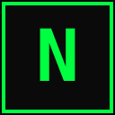

<p align="center">
  
</p>

<h1 align="center">NAVI Startpage</h1>

<p align="center">
  Cyberpunk-styled New Tab replacement with a self-hosted feed aggregator.<br/>
  No cloud. No telemetry. Runs on your network.
</p>

<p align="center">
  
  
  
  
</p>

---

## Features

- **Bookmarks grid** with collapsible categories and emoji/favicon icons
- **Omnibar** — unified search across bookmarks, history, and web (Kagi/Google/DuckDuckGo)
- **Feed aggregator** — RSS, Hacker News, Reddit, Boosty, Sponsr in categorized columns
- **Cyberpunk UI** — dark/light/system themes, full color customization, monospace typography
- **Self-hosted backend** — Go service with in-memory cache, Docker-ready, ~15 MB image
- **Offline-first** — works without backend in local mode, graceful degradation on network failure
- **Zero cloud dependencies** — all data stays on your network

## Quick Start

### Extension only (no backend)

```bash
cd client
npm install
npm run build
```

1. Open `chrome://extensions/`, enable **Developer mode**
2. Click **Load unpacked** → select `client/dist/`
3. Open a new tab

### With feed aggregator

```bash
# 1. Start the backend
cd server
cp config.example.yaml config.yaml    # edit config.yaml with your sources
docker build -t navi-core .
docker run -d -p 8080:8080 \
  -v $(pwd)/config.yaml:/etc/navi/config.yaml:ro \
  navi-core

# 2. Build the extension
cd ../client
npm install && npm run build
```

Then in the extension: **Settings → FEED → Enable**, set server URL and API token.

## Architecture

```
navi-startpage/
├── client/              Browser extension (Preact + TypeScript + Vite)
│   ├── src/
│   │   ├── components/  UI components (App, Omnibar, BookmarksGrid, FeedSection, Settings)
│   │   ├── services/    Storage, search, feed API client
│   │   ├── config/      Default bookmarks and themes
│   │   └── types/       TypeScript interfaces
│   └── public/          manifest.json, icons
│
└── server/              Feed aggregator (Go + Gin)
    ├── cmd/navi-core/   Entry point
    └── internal/
        ├── parser/      RSS, HN, Reddit, Boosty, Sponsr parsers
        ├── cache/       Thread-safe in-memory cache
        ├── scheduler/   Periodic feed fetcher
        ├── handler/     HTTP handlers + auth middleware
        └── config/      YAML config loader
```

The extension works standalone. The backend is optional — it aggregates feeds and serves them over a simple REST API.

## Configuration

### Extension

All settings are available through the built-in Settings modal (click **SETTINGS** in the status bar or press `,`):

- Bookmark categories and links
- Feed server URL and token
- Search engine fallback URL
- Grid columns, theme colors, fonts

Default bookmarks can be pre-configured in `client/src/config/defaults.ts`.

### Backend

```yaml
server:
  port: 8080
  api_secret: "your-random-token"   # required
  feed_interval: 10m

feed_categories:
  - name: NEWS
    sources:
      - type: hn
        max_items: 20
      - type: rss
        url: https://blog.golang.org/feed.atom

  - name: REDDIT
    sources:
      - type: reddit
        subreddit: selfhosted

  - name: BOOSTY
    sources:
      - type: boosty
        creator: author-slug
        cookie: "optional-session-cookie"
```

Supported source types: `rss`, `hn`, `reddit`, `boosty`, `sponsr`.

### API

| Endpoint | Auth | Description |
|---|---|---|
| `GET /api/health` | No | Health check |
| `GET /api/feed` | Bearer | All feed items |
| `GET /api/feed?source=hn,rss` | Bearer | Filter by source |
| `GET /api/feed?category=NEWS` | Bearer | Filter by category |

## Safari

```bash
xcrun safari-web-extension-converter client/dist/ \
  --app-name "NAVI Startpage" \
  --bundle-identifier com.navi.startpage
```

Open the Xcode project, set signing team, build. Enable in **Safari → Settings → Extensions**.

> **Note:** Safari does not support the `bookmarks` and `history` WebExtension APIs. Omnibar will only offer web search — no local bookmarks or history results.

## Development

```bash
# Client
cd client
npm run dev            # rebuild on changes
npm run test           # run tests
npm run test:watch     # watch mode

# Server
cd server
go run ./cmd/navi-core --config config.yaml
go test ./...
```

## Tech Stack

| Layer | Technology |
|---|---|
| Extension | Preact, TypeScript, Vite, CSS Modules |
| Backend | Go, Gin, gofeed, goquery |
| Deployment | Docker (alpine, ~15 MB) |
| Target | Chrome (MV3), Safari |

## License

[MIT](LICENSE)
